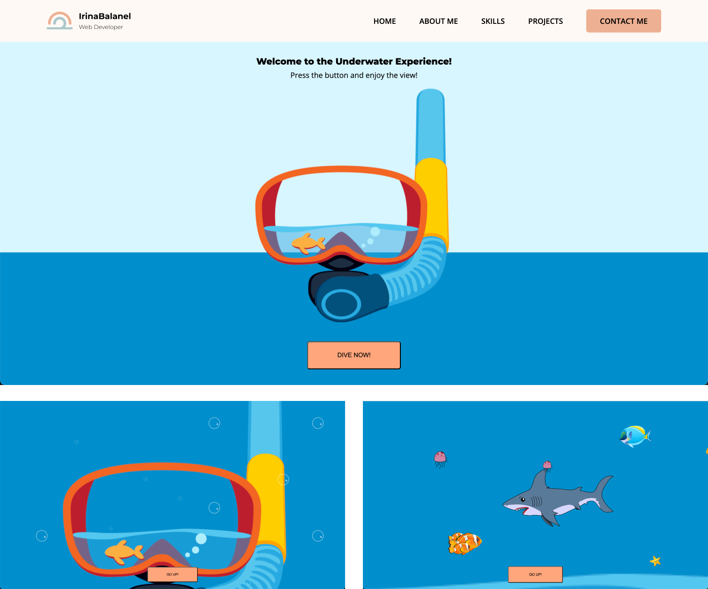

# Underwater Experience

## Description
The website represents an interactive “Underwater Experience” page showcasing advanced knowledge of CSS transitions, transforms, and keyframe animations, which received top feedback for high code quality and creative design.

## Demo
[Underwater Experience](https://underwater.irinabalanel.com/)

## More projects
Explore more of my work on my portfolio: [irinabalanel.com](https://irinabalanel.com)

## Frames

